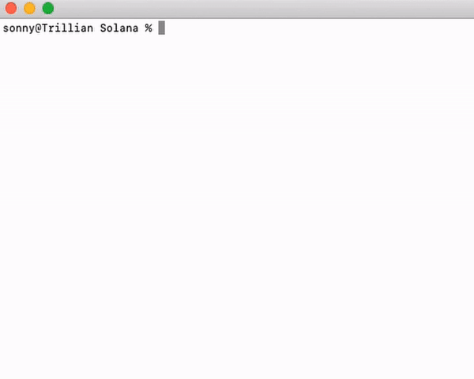
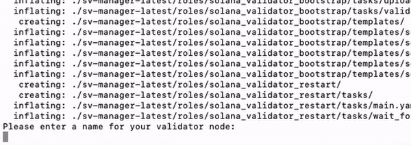

# Solana Validator Manager


### Quick Install

* Log in to your server
* Create the key pair file (you can also upload it via scp if you prefer):
  ````shell
  nano ~/validator-keypair.json
  ````   
  Paste your key pair, save the file (ctrl-O) and exit (ctrl-X).


  If you have a *vote account* key pair, create the key pair file (or upload it via scp):
  ````shell
   nano ~/vote-account-keypair.json
  ````  
  Paste your key pair, save the file (ctrl-O) and exit (ctrl-X).
* Run this command…

````shell
/bin/bash -c "$(curl -fsSL https://raw.githubusercontent.com/NEWSOROS/sv-manager/main/install/install_validator.sh)"
````
  
…and follow the wizard’s instructions (__enter your own Node name!__):

  

That's it, you are all set!

### How to update validator

````shell
/bin/bash -c "$(curl -fsSL https://raw.githubusercontent.com/NEWSOROS/sv-manager/main/install/update_test_validator_version.sh)" --version 1.8.11
````

### how to update monitoring

````shell
/bin/bash -c "$(curl -fsSL https://raw.githubusercontent.com/NEWSOROS/sv-manager/main/install/update_monitoring.sh)" 
````


### If you want more control over the configuration of your node, please refer to the [advanced technical specifications](docs/advanced.md)


## Useful links

* [Solana](https://solana.com/)
* [Monitoring Dashboard](https://solana.thevalidators.io/)
* [Validator docs](https://docs.solana.com/running-validator)

## How you can support this project

- Join our Telegram community [t.me/thevalidators](https://t.me/thevalidators)
- Fork, improve, and promote
- Stake with [Joogh Validator](https://solanabeach.io/validator/DPmsofVJ1UMRZADgwYAHotJnazMwohHzRHSoomL6Qcao)
- Donate Sol to [Joogh Validator Identity Account](https://joogh.io) on Solana: 8yjHdsCgx3bp2zEwGiWSMgwpFaCSzfYAHT1vk7KJBqhN
- Donate BTC: bc1q9vkmfpmk77j2kcsdy2slnv6ld4ahg2g5guysvy

### [Powered by mFactory Team](https://mfactory.tech)
